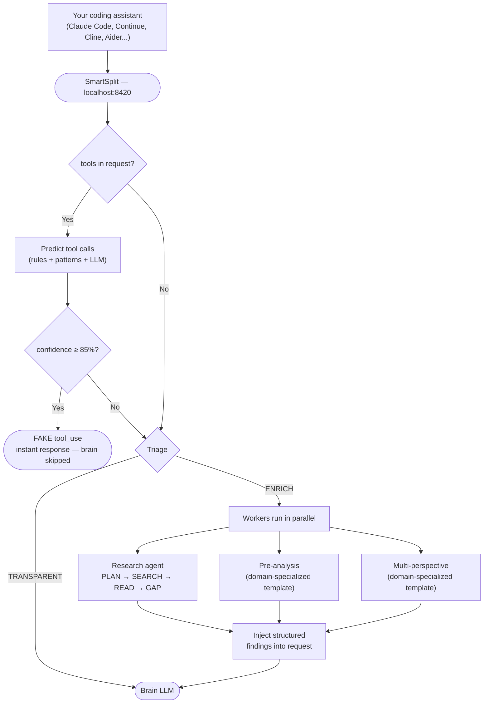

# ⚠️ Work in progress — not usable yet

**This repository is under active development. It is not finished and not ready for use.** APIs, behavior, and structure change without notice. Expect breakage. Do not rely on it for anything yet.

---

<div align="center">


[](https://github.com/dsteinberger/smartsplit/actions/workflows/ci.yml)
[](https://python.org)
[](LICENSE)
[](https://codecov.io/gh/dsteinberger/smartsplit)
[](https://docs.astral.sh/ruff/)

**Why use one LLM when you can use them all?**

One brain to think, many models to prepare. Each LLM does what it does best.<br>
Works with any mix of free and paid providers.

**13 providers** · **7+ IDE integrations** · **MIT**

[Quick Start](#quick-start) · [How It Works](#how-it-works) · [Providers](#providers) · [Metrics](#metrics)

</div>

---

## Who is this for?

- **Developers without a paid subscription** who want a powerful AI coding assistant using free LLMs.
- **Developers with a paid API budget** who want to make it last — SmartSplit routes simple tasks to free models and saves your paid tokens (OpenAI, Anthropic) for complex work. No config needed, it's the default behavior.
- **Teams** who want to combine multiple LLMs without changing their existing tools.
- **Anyone** frustrated by a single model that's great at code but bad at everything else.

---

## The problem

You ask your coding assistant to write a function, explain an algorithm, translate a comment, and find the latest docs. It sends **everything to the same model** — and that model is average at most of these tasks.

**Before SmartSplit:**
```
Agent: "Fix the bug in parser.py"

  → Brain: "Let me read parser.py"       (round-trip 1)
  → Brain: "Now let me grep for errors"   (round-trip 2)
  → Brain: "Here's the fix"
  = Brain waited twice before thinking
```

**After SmartSplit:**
```
Agent: "Fix the bug in parser.py"

  → SmartSplit predicts read_file(parser.py) — FAKE tool_use (~200ms)
  → Agent reads the file itself, instantly
  → Brain already has the context, responds in one shot
  = 1 round-trip saved · ~40% less latency · 0 tokens wasted
```

Same tool. Faster answers. No config change.

### What makes SmartSplit different

**Get more from every key — free or paid.** One free tier runs out fast; one paid key drains faster than you think. SmartSplit spreads requests across all your providers — each contributing its free quota, each specialized for what it does best. Got an OpenAI or Anthropic key too? It picks the right tier per task automatically — cheap model for boilerplate, top model for reasoning. More providers = more capacity. Smarter routing = budget that lasts.

```
Simple task (boilerplate, summary)  → Haiku / GPT-4o-mini  (cheap)
Complex task (code, reasoning)      → Sonnet / GPT-4o      (best)
Everything else                     → Free models first
```

**Faster responses.** SmartSplit predicts what your brain will ask for — files, greps, searches — and returns it instantly as a FAKE tool call. Your agent executes locally, the brain skips a full round-trip. Less waiting, fewer tokens, every request.

**Keep your Claude subscription.** Already paying for Claude Pro or Max? Don't cancel it — supercharge it. SmartSplit plugs in as an HTTPS proxy, your Claude Code authentication stays untouched, and round-trips get cut automatically. No API key swap, no workflow change.

**Gets smarter over time.** A pattern learner observes your actual tool calls (Wilson-scored confidence); adaptive routing (MAB/UCB1) auto-calibrates provider scores from real results. The more you use SmartSplit, the sharper its predictions get.

<details>
<summary><b>More — reliability, safety, i18n, compatibility</b></summary>

**Robust by default.** Provider down? Circuit breaker opens with exponential backoff and reroutes. Prediction misses, enrichment fails, brain refuses? The request silently falls through as a transparent proxy. You never see an error that wouldn't have happened without SmartSplit.

**Read‑only by design.** SmartSplit only anticipates *reads* — files, greps, web searches. It never writes, never edits, never executes. Sandboxed to your working directory, 5s timeout, no exceptions. Safer than your own shell.

**Web-aware in 9 languages.** When your prompt needs current data — in English, French, Spanish, Portuguese, German, Chinese, Japanese, Korean, or Russian — SmartSplit detects it, runs a **mini research agent** (plan queries → search → read & synthesize → optional gap-fill) under a strict 7 s budget, and feeds *sourced findings* to your brain. Each fact arrives with a confidence level and a URL, not a blob of snippets. If any step times out, the pipeline gracefully degrades to raw snippets — never blocks the response.

**Domain-specialized analysis.** When your prompt needs deep pre-analysis or a multi-perspective comparison, SmartSplit picks the right template for the detected domain — code, math, creative, writing, factual — and routes the work to the worker that's strongest on *that specific combination* (e.g. `reasoning.math` prefers Gemini/DeepSeek, `reasoning.creative` prefers Claude/Mistral). One less generic "please analyze" prompt, one more structured checklist the brain can cite.

**One format, any backend.** Your tool talks OpenAI. SmartSplit translates to Anthropic, Gemini, or whatever brain you configure — SSE streaming preserved. Swap the engine without swapping the wheel.

**Cache‑friendly enrichment.** Context is injected surgically (last user message) so Anthropic's prompt cache keeps hitting. Other proxies break the cache on every request — yours doesn't.

</details>

---

## Quick Start

### 1. Install

```bash
pip install smartsplit            # API mode (Continue, Cline, Aider...)
# or
pip install smartsplit[proxy]     # HTTPS proxy mode (Claude Code)
```

### 2. Get a free API key (2 minutes)

You need **one key** to start. Sign up at [groq.com](https://groq.com) and copy your API key.

> Add more providers later for better routing. Each new provider = better results, more fallbacks. See [Providers](#providers).

### 3. Start SmartSplit

```bash
export GROQ_API_KEY="gsk_..."
smartsplit
```

```
  SmartSplit — Multi-LLM backend
  API:    http://127.0.0.1:8420/v1
  Proxy:  http://127.0.0.1:8421   (HTTPS_PROXY for Claude Code)
  Mode:   balanced
```

> API + HTTPS proxy run side by side in one process. Use `--api-only` or `--proxy-only` to run just one.

<details>
<summary><b>Or use Docker</b></summary>

```bash
# Create a .env file with your API keys
echo 'GROQ_API_KEY=gsk_...' > .env

# Run with Docker
docker run -p 8420:8420 --env-file .env ghcr.io/dsteinberger/smartsplit

# Or with Docker Compose
docker compose up -d
```
</details>

### 4. Connect your coding tool

<details open>
<summary><b>Claude Code</b> (Terminal)</summary>

Claude Code connects via HTTPS proxy — SmartSplit intercepts requests transparently.

```bash
# Terminal 1: start SmartSplit (API + proxy unified — default)
smartsplit

# Terminal 2: launch Claude Code through the proxy
NODE_EXTRA_CA_CERTS=~/.smartsplit/certs/ca-cert.pem \
HTTPS_PROXY=http://localhost:8421 \
claude
```

That's it — Claude Code's tool calls are now anticipated by SmartSplit, saving round-trips automatically.

> Only running Claude Code? Use `smartsplit --proxy-only` to skip the API endpoint (proxy then listens on :8420).
</details>

<details>
<summary><b>Continue</b> (VS Code / JetBrains)</summary>

Copy [`examples/.continuerc.json`](examples/.continuerc.json) to your project as `.continuerc.json`, or add to `~/.continue/config.yaml`:

```yaml
models:
  - name: SmartSplit
    provider: openai
    model: smartsplit
    apiBase: http://localhost:8420/v1
    apiKey: free
```
</details>

<details>
<summary><b>Cline</b> (VS Code)</summary>

In the Cline sidebar, click the gear icon:
1. Select **OpenAI Compatible** as provider
2. Base URL: `http://localhost:8420/v1`
3. API Key: `free`
4. Model ID: `smartsplit`
</details>

<details>
<summary><b>Aider</b> (Terminal)</summary>

Copy [`examples/.aider.conf.yml`](examples/.aider.conf.yml) to your project as `.aider.conf.yml`, or run:

```bash
aider --model openai/smartsplit --openai-api-base http://localhost:8420/v1 --openai-api-key free
```
</details>

<details>
<summary><b>OpenCode</b> (Terminal)</summary>

Copy [`examples/opencode.json`](examples/opencode.json) to your project root, run `opencode providers` to add the API key (`free`), then select the model with `/models`.
</details>

<details>
<summary><b>Tabby</b> (Self-hosted autocomplete)</summary>

Add to `~/.tabby/config.toml`:

```toml
[model.chat.http]
kind = "openai/chat"
model_name = "smartsplit"
api_endpoint = "http://localhost:8420/v1"
api_key = "free"
```
</details>

<details>
<summary><b>Void</b> (Open-source IDE)</summary>

In Void settings:
1. Find **OpenAI-Compatible** section → set Base URL `http://localhost:8420/v1`, API Key `free`
2. In **Models** section → Add Model, select OpenAI-Compatible, name: `smartsplit`
</details>

<details>
<summary><b>Any OpenAI-compatible client</b></summary>

```python
from openai import OpenAI
client = OpenAI(base_url="http://localhost:8420/v1", api_key="free")
```

SmartSplit works with **Claude Code** (via HTTPS proxy) and **any tool that supports a custom OpenAI endpoint**: Continue, Cline, Aider, OpenCode, Tabby, Void, Cursor, Open WebUI, Chatbox, LibreChat, Jan, and more.
</details>

**That's it.** Three steps: install, add one API key, connect your tool. Your assistant now has access to every top free LLM.

---

## How It Works



### Agent mode — tools detected

When the request includes `tools` (Claude Code, Cline, Aider...), SmartSplit first tries to **predict** what the brain will ask for. If confidence is high enough (≥ 85%), it responds with a **FAKE tool_use** — the agent executes the reads itself, saving a full round-trip.

Otherwise, the request **continues to triage** — TRANSPARENT or ENRICH — just like API mode. If enrichment is needed (web search, analysis...), the results are injected into the request before forwarding to the brain. Tools are always preserved.

```
"Fix the bug in parser.py" (with tools: read_file, grep, edit...)

  [predict]  → confidence 92% → FAKE tool_use(read_file, parser.py)
  → Agent executes the read itself — brain skipped, 1 round-trip saved

"What's new in Python 3.13?" (with tools: web_search, read_file...)

  [predict]  → confidence 60% → not enough
  [triage]   → ENRICH
  [workers]  → web search + summarize
  [inject]   → enriched context added to request
  [forward]  → brain LLM with tools preserved
```

### API mode — no tools

Without tools, SmartSplit goes straight to triage: **TRANSPARENT** (forward directly, zero overhead) or **ENRICH** (workers prep context first).

```
"What are the new features in Python 3.13?"

  [web_search]        → mini research agent (PLAN → SEARCH → READ → GAP)
                        → sourced findings: FACT (high): ... [source: url]
  [pre_analysis]      → domain-aware worker (code / math / creative / …)
                        → structured markdown: ## Invariants, ## Edge cases, …
  [multi_perspective] → domain-aware worker
                        → per-option: Claim / Evidence / Cost / Who-it-fits

  → Brain gets structured, sourced context injected as labelled sections
```

Each enrichment has a hard time budget and degrades gracefully — if research times out it falls back to raw snippets; if a worker fails, the other sections still reach the brain. The request is never blocked by a slow worker.

### Built-in reliability

| Feature | What it does |
|---------|-------------|
| **Circuit breaker** | 5 failures in 2 min → provider auto-disabled with exponential backoff |
| **Quality gates** | Detects refusals ("I cannot...") → auto-escalation to next provider |
| **Fallback chains** | Provider fails → next best one takes over, seamlessly |
| **Research budget** | Mini research agent capped at 7 s; each step (plan/search/read/gap) degrades to the previous one on timeout — never blocks the request |
| **Pattern learning** | Learns from actual tool calls (Wilson score) → better predictions over time |
| **Adaptive scoring** | Learns which providers work best from real results (MAB/UCB1), per-domain when a `reasoning.<domain>` row is configured |

---

## Providers

### Supported providers

| Provider | Type | Best at |
|----------|------|---------|
| **Cerebras** | Free | Reasoning, general (Qwen 3 235B) |
| **Groq** | Free | Fast inference (LLaMA 3.3 70B) |
| **Gemini** | Free | Math, reasoning (Gemini 2.5 Flash) |
| **OpenRouter** | Free | Code (Qwen3 Coder 480B) |
| **Mistral** | Free | Translation (Mistral Small) |
| **HuggingFace** | Free backup | Code (Qwen2.5 Coder 32B) |
| **Cloudflare** | Free backup | General (LLaMA 3.3 70B) |
| **DeepSeek** | Paid | Code, reasoning |
| **Perplexity** | Paid | Web search + factual (Sonar/Sonar Pro) |
| **Anthropic** | Paid | Complex tasks (Claude) |
| **OpenAI** | Paid | Complex tasks (GPT-4o) |
| **Serper** | Free | Web search |
| **Tavily** | Free | Web search |

Add providers by setting environment variables:

```bash
export GROQ_API_KEY="gsk_..."
export GEMINI_API_KEY="AIza..."
export DEEPSEEK_API_KEY="sk-..."
export CEREBRAS_API_KEY="csk-..."
export MISTRAL_API_KEY="..."
export OPENROUTER_API_KEY="sk-or-..."
export HF_TOKEN="hf_..."
export CLOUDFLARE_API_KEY="..."
export CLOUDFLARE_ACCOUNT_ID="..."
export SERPER_API_KEY="..."
export PERPLEXITY_API_KEY="pplx-..."  # paid — https://console.perplexity.ai/
```

More providers = better routing, more fallbacks, higher resilience.

> **Format translation is automatic.** Most providers use the OpenAI format natively. Gemini uses Google's own format — SmartSplit translates on the fly. Your client talks OpenAI, SmartSplit handles the rest.

> **Paid providers** (DeepSeek, Anthropic, OpenAI, Perplexity) work as brain *or* worker alongside free ones. Put them in `worker_priority` and the router uses them wherever their score wins. Disabled by default — enable in config or set the corresponding env var.

<details>
<summary><b>Routing table</b></summary>

Ranked by competence score. Paid providers are marked `(paid)` — they compete on merit and are picked only when scoring wins (and the key is configured).

```
Task          Best workers (ranked)
─────────────────────────────────────────────────────────────────────
code          OpenRouter = DeepSeek (paid) > Anthropic = OpenAI (paid) > Cerebras = Gemini > Groq
reasoning     Cerebras = DeepSeek (paid) = Anthropic = OpenAI (paid) > Gemini = OpenRouter > Groq
summarize     Cerebras = DeepSeek (paid) = Anthropic (paid) > Groq = Gemini = Mistral = OpenRouter
translation   Mistral > Gemini = DeepSeek = Anthropic = OpenAI (paid) > Groq = Cerebras
web search    Perplexity (paid) > Serper = Tavily
boilerplate   Groq = Cerebras = DeepSeek (paid) > Gemini = Mistral = OpenRouter
math          DeepSeek (paid) > Anthropic = OpenAI (paid) > OpenRouter = Gemini > Cerebras > Groq
general       Cerebras = DeepSeek (paid) = Anthropic (paid) > Gemini = OpenRouter > Groq = Mistral

Backups:      HuggingFace, Cloudflare (lower quality, high availability)
```
</details>

---

## Metrics

```bash
curl http://localhost:8420/metrics
```

```json
{
  "requests": { "total": 142, "enrich": 42, "transparent": 100 },
  "savings": { "tokens_saved": 45000, "cost_saved_usd": 0.135 },
  "cache": { "hits": 23, "hit_rate": 16.2 },
  "circuit_breaker": { "unhealthy_providers": [] }
}
```

Also available: `GET /health` · `GET /savings`

---

## Configuration

<details>
<summary><b>CLI options</b></summary>

```bash
smartsplit                          # defaults: port 8420, balanced mode
smartsplit --port 3456              # custom port
smartsplit --mode economy           # max free usage
smartsplit --mode quality           # prefer quality over speed
smartsplit --log-level DEBUG        # verbose logging
```
</details>

<details>
<summary><b>Debug mode</b></summary>

Add `DEBUG=1` before any make command — works everywhere:

```bash
DEBUG=1 make run          # API mode, verbose logs
DEBUG=1 make proxy        # proxy mode, verbose logs
DEBUG=1 make up           # Docker API mode, verbose logs
DEBUG=1 make up-proxy     # Docker proxy mode, verbose logs
```

Logs provider scores, triage decisions, prediction details, and worker results. Useful for troubleshooting routing or sharing logs with the team.

</details>

<details>
<summary><b>Config file</b> (alternative to env vars)</summary>

```bash
cp smartsplit.example.json smartsplit.json
# Edit with your API keys
```

You can also tune provider settings and routing:

```json
{
  "mode": "balanced",
  "worker_priority": ["cerebras", "groq", "gemini", "openrouter", "mistral", "huggingface", "cloudflare"],
  "research_budget_seconds": 7.0,
  "research_enabled": true,
  "providers": {
    "groq": {
      "model": "llama-3.3-70b-versatile",
      "temperature": 0.3,
      "max_tokens": 4096
    },
    "serper": {
      "max_search_results": 5
    }
  }
}
```

| Option | Default | What it does |
|--------|---------|-------------|
| `worker_priority` | cerebras, groq, gemini, openrouter, mistral, huggingface, cloudflare | Fallback order for worker LLM calls. Paid providers (DeepSeek, OpenAI, ...) are welcome here. |
| `research_budget_seconds` | `7.0` | Total wall-clock budget for the mini research agent (PLAN + SEARCH + READ + optional GAP). Also settable via `SMARTSPLIT_RESEARCH_BUDGET`. |
| `research_enabled` | `true` | Kill switch for the mini research agent — set to `false` to skip the research pipeline entirely. Also settable via `SMARTSPLIT_RESEARCH_ENABLED`. |
| `providers.*.model` | per-provider default | Override the default model |
| `providers.*.temperature` | `0.3` | LLM temperature |
| `providers.*.max_tokens` | `4096` | Max output tokens |
| `providers.*.max_search_results` | `5` | Number of web search results |

</details>

<details>
<summary><b>Docker</b></summary>

```bash
# Using the published image
docker run -p 8420:8420 --env-file .env ghcr.io/dsteinberger/smartsplit

# Or build locally
docker build -t smartsplit .
docker run -p 8420:8420 --env-file .env smartsplit
```

Create a `.env` file with your API keys:
```bash
GROQ_API_KEY=gsk_...
SERPER_API_KEY=...
GEMINI_API_KEY=AIza...
```

> Never commit `.env` to git — it's already in `.gitignore`.

Or use Docker Compose:
```bash
docker compose up -d
```
See [`docker-compose.yml`](docker-compose.yml) for the full setup.
</details>

---

## Development

**Prerequisites:** Python 3.11+ and [uv](https://docs.astral.sh/uv/getting-started/installation/) (recommended) or pip.

```bash
git clone https://github.com/dsteinberger/smartsplit.git
cd smartsplit
make install              # or: pip install -e ".[dev]"

make check                # lint + format check + tests
make test                 # tests only
make run                  # start server (requires at least one API key)
make help                 # all commands
```

> **Note:** `make test` runs all tests without any API key — no provider needed for development.

See [CONTRIBUTING.md](CONTRIBUTING.md) for guidelines.

---

## Architecture

```
smartsplit/
  cli.py                    CLI entry point — argument parsing, mode dispatch
  config.py                 Configuration + brain auto-detection + env vars
  models.py                 Pydantic models + StrEnum
  exceptions.py             Custom error hierarchy
  json_utils.py             Shared JSON helpers
  proxy/
    server.py               HTTPS proxy — TLS interception, CONNECT tunneling
    pipeline.py             Starlette app + SmartSplit pipeline (agent/API modes)
    intercept.py            Shared interception logic — compression, prediction
    formats.py              OpenAI/Anthropic format conversion + SSE streaming
  tools/
    registry.py             Single source of truth for tool definitions + categories
    intention_detector.py   Predicts tool calls (rules + patterns + LLM)
    anticipator.py          Executes anticipated tools locally (safe reads only)
    pattern_learner.py      Learns from actual tool calls (Wilson score)
    anticipation.py         Tool anticipation helpers
  triage/
    detector.py             Request triage — TRANSPARENT or ENRICH (keywords + LLM)
    planner.py              Domain detection + prompt decomposition
    enrichment.py           ENRICH path — orchestrates research agent + analysis workers, injects structured sections into the brain prompt
    enrichment_prompts.py   Domain-specialized templates for pre_analysis / multi_perspective (code, math, creative, writing, factual)
    research.py             Mini research agent — PLAN → SEARCH → READ → GAP with time budget + graceful degradation
    research_prompts.py     Prompts for the research agent (plan queries, synthesize findings, gap-fill)
    i18n_keywords.py        Multilingual keyword translations (generated)
  routing/
    router.py               Provider scoring + routing + quality gates
    learning.py             MAB (UCB1) adaptive scoring
    quota.py                Usage tracking + savings report
  providers/                One file per provider (most are 2 lines)
```

A new OpenAI-compatible provider is just 2 lines:

```python
class NewProvider(OpenAICompatibleProvider):
    name = "new"
    api_url = "https://api.new.com/v1/chat/completions"
```

Plus a few config entries (default model, env var, competence scores) — see [CLAUDE.md](CLAUDE.md) for the full checklist.

---

## Ready to multiply your coding assistant?

```bash
pip install smartsplit
```

**[⭐ Star the repo](https://github.com/dsteinberger/smartsplit)** · [🐛 Report issues](https://github.com/dsteinberger/smartsplit/issues) · [💬 Discussions](https://github.com/dsteinberger/smartsplit/discussions)

<details>
<summary><b>Disclaimer</b></summary>

SmartSplit is a personal development tool. Each user must provide their own API keys and comply with the terms of service of each provider they use. SmartSplit does not store, share, or redistribute API keys or access. The authors are not responsible for any misuse or ToS violations by end users.

</details>

---

<div align="center">

MIT License · [Contributing](CONTRIBUTING.md) · [Security](SECURITY.md) · [Changelog](CHANGELOG.md)

</div>
